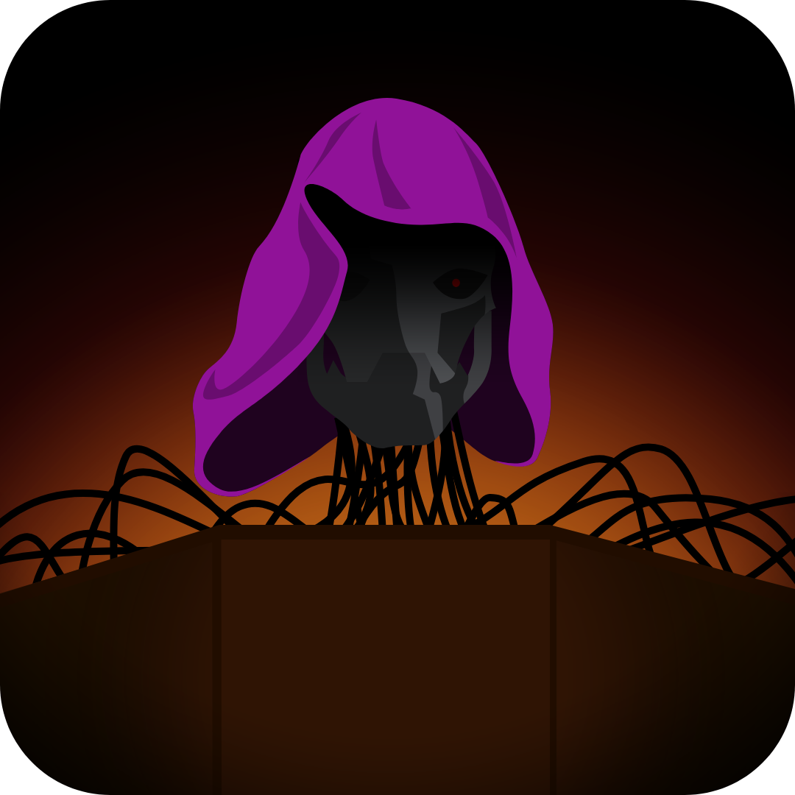

# Capstone Team Report

# Section 1: Cover Page
### **The GM-PC**
##### **Your Eternal GM**

[Add your name], JohnMichael Ross, Henry Tan, Joshua Burick

---

# Section 2: Introduction

This product is a web-hosted AI that should serve to eliminate the necessity of the 'Game Master' (GM) role for the Table-Top Role Playing Game (TTRPG) 'Lasers and Feelings' by taking on the responsibilities of said role, thus reducing the time and stress that would be required of an individual in planning and tracking a campaign session. With this, we aim to serve a number of existing or potential players with emphasis on those who want to take a break from being the designated GM but whose players aren't willing to serve as a substitute, those who want to start a campaign but aren't confident enough in the rules or their improvisational abilities to try hosting the game, or those groups who can barely manage to schedule a session together let alone have someone plan anything substantial.

Utilizing this system, players should be able to create and customize their own games of 'Lasers and Feelings', specifying the tone, difficulty, and general feel of the game, and being able to change it as the party needs or wants. This service aims to streamline not only the process of character creation, but the flow of the game once in-action as well, handling the ideation of consequences for actions and reducing time wasted looking up rules or stats. Players can get into the action queue, send their actions from their own device, roll for success, and watch on the main screen as the AI GM dictates the results and consequences. This AI GM is also functional in the case of long-play, capable of running a campaign for as long as the players want or until they reach a game-over.

---

# Section 3: Representative Tasks

### Action Queue and Emergency Meter

- **MVP:** As the AI finishes with its harrowing description of the shapeshifting ooze squeezing its way through the locked door on the other side of the corridor the party realizes they've now trapped themselves in a box with the creature. Andrew realizes that as a soldier, he has a small chance to scare it off with some rounds of his laser pistol, so he hurriedly joins the action queue. To his frustration, Ian's engineer got in queue before him so he will have to wait for his turn. Andrew takes this moment to survey the situation and realizes with horror that the emergency meter has almost reached a critical point, and one more catastrophic failure could swiftly end this campaign. (cont.)

### Help Action

- **MVP:** (cont.) While this is happening, Ian is explaining to the group and typing up how he wants his engineer to tear open the nearby door panel and short-circuit the whole power relay for the spacecraft wing, thereby opening the door. Hearing this, Andrew jumps in the discussion mentioning how his soldier has unused microcharges that Ian could probably use to expedite the process and indicates on his phone that he wants to help the current action. The AI GM waits for Ian to finish his action description and Andrew to finish help explanation before deciding both actions are reasonable. The extra die Andrew provided Ian when rolling for outcome makes the critical difference and the party narrowly escapes the encounter.

### Adventure Summary

- **MVP:** Jimmy and his friends have had trouble scheduling time to get together and play as a group, so it's been a week or two since the last time they played. While they all can agree that they had defeated the space pirates at the end of the last session, they can't agree on what they had started to do next. To solve this problem, Jimmy has the AI GM create a summary of what happened last time in their adventures. The AI informs them of their exploits, ship status, items-on-hand, and individual status; in particular, the GM explains that after the space pirate attack, their ship had sustained major damage and they were on their way to the nearest port to get some repairs performed with some cash on-hand. This settles the debate and centers the group on a clear next course of action.

### Game Creation

- **MVP:** Matthew has been wanting to try out 'Lasers and Feelings', but with his prior experience solely consisting of urban-fantasy, relaxed, roleplaying games, he feels a little lost in what a sci-fi session should look like, but he does have a general idea for how he wants it to feel when playing. Matthew begins creating a new campaign, selecting the level of realism, setting the expected difficulty for combat and key actions, and listing a variety of keywords he wants the AI GM to refer to for tone such as 'relaxed', 'low-stakes' and 'adventure'. He wraps up the campaign creation by giving it a suitably fun name, 'Deep Green No. 5, and starts calling his friends to come over, whip up some characters, and test out the game system with him. (cont.)

### Character Creation

- **MVP:** (cont.) After arriving at Matthew's place, Walter connects with his individual device to create a character for the campaign. Walter starts to design his character, choosing for them to be a dangerous scientist with a stat number of 2, making his character more science-oriented and coldly rational. Right as he's about to name his character, Matthew starts laughing at him because he spies on the main screen that Walter has accidentally made his character a charismatic envoy. Walter quickly navigates back to the character's role part of the creation, changing it to scientist before going back to name his character and confirm that he is ready to play.

### Invalid Action

- **MVP:** As the oxygen slowly drains from Isaiah's character's lungs and out into the void of space, he knows that what his next action is, it might be the last. The other players, noting the severity of the situation with this character clinging for dear-life to a jammed outer bay door, remove themselves from the action queue to allow Isaiah to take action immediately. Desperate for a quick solution, Isaiah tells the AI that he has a universal solvent on hand which would easily dissolve through the alien sludge holding the door shut and let him back into the safety of the ship. The AI ponders this for a moment, but considering Isaiah's character is an explorer and does not explicitly have this item in his inventory, it judges that he would not be able to perform this action and informs him of such. (cont.)

### Adventure History

- **MVP:** (cont.) Dismayed, Isaiah is about to give up when he decides to check the adventure history and finds that this alien species is aquaphobic, suggesting that using water might have the desired effect. Isaiah repeats his prior input but with water this time, and although he was not explicitly carrying water, the GM decides it is reasonable for an explorer to always have a portion of water or similar liquid available. The water splashes and eats away at the blockage letting Isaiah's character pry open the bay door and scramble into the hold to safety, the door slamming shut behind him.

### Narrative Tone

- **MVP:** Bill is in the process of setting up the weekly game session for him and his friends when he learns that Carl has had a particularly rough week with work. Typically these friends enjoy hard-fought, intense combat and making high-risk decisions, so their tone parameters usually include serious, strategic, and deadly keywords. However, Bill doesn't want this session to add to Carl's stress, so he silently edits the tone parameters of the campaign, removing the more serious keywords and replacing them with lighter, more-fun alternatives. This changes the tone of the AI Game Master's descriptions as well as the severity of some consequences, leading to a session enjoyed by all participants, especially Carl.

### Storing Save Data

- **MVP:** Caleb has just finished another long session of his solo campaign and wants to continue this adventure at a later point in time. He has noticed the occasional message of 'Quick Saved' pop up across his various play sessions and noted that his game picks up right where he left off when he returns. However, Caleb plans on trading in his computer due to its poor performance and inability to handle required software for work. With this, Caleb saves a file-copy of his game data to later transfer his game to his new device, load up the data and continue playing that same campaign with his favorite character. 

---

# Section 4: Related Work
### Pokémon FireRed/LeafGreen

- Pokémon FireRed[1] is vastly different than our product, but one feature of the games has inspired part of our design. These games have a feature where when the player launches the game, it shows a brief summary of a couple of events/actions that the player took part in the last time they played the game. These games show text along with a little recording of the player at the place of the events described. This is similar to the summary feature that will be in our product, since both will describe to the players a summary of the key events that took place in the last session they played. There are definitely some differences however, as we will be using an AI model to summarize the key events since there is a large focus on the AI Game Master in our product. There will also be no visual component along with the text descriptions, as visual displays of the adventure are less important with regards to our target audience's important tasks related to a more text-based experience, and do not lie within the proposed design of our product.

### The Devils and the Details

- The Devils and the Details is one of the games featured in The Jackbox Party Pack 7[2], having players take on the roles of various family members to work either together or individually to complete tasks and raise a collective team score above a threshold. This game shares several superficial elements with our project in that they both have a primary screen where the team status is shown and utilize individual devices on which players can perform actions. However, the actual gameplay and actions performed are radically different, with The Devils and the Details playing as a series of minigames and our project serving as means for text input and action-order resolution. One aspect of The Devils and the Details we do want to emulate however is the emergency meter; during the game, players can perform selfish actions which give a lot of individual points but lower the team score and raise the emergency rating. Upon the emergency rating reaching a critical point, the game switches to a salvage point where everyone is forced to fix a 'family emergency' such as the basement flooding. While this exact idea will not work for Lasers and Feelings as the players are entirely cooperative, having an emergency meter displayed on the main screen along with encroaching danger lights for the ship or general team status would help to add tension to a series of bad rolls, lead to team discussion and inerplay, and depending on what parameters the players create the session with, lead to a game-over given Lasers and Feelings does not specify an actual endpoint.

### Mario Kart Wii

-Mario Kart Wii[3] is a racing game that is very different from our product. However, one of the elements that has inspired us is the end of race results screen. After completing a collection of races, the game presents the final results and summarizes how the players performed. Unlike Mario Kart, our product will not rank individual players or assign points based on their performance, since Lasers & Feelings is a cooperative game. Instead, the results screen could provide a summary of the adventure, highlighting significant events, important decisions, memorable moments, and the overall outcome of the session. This would give players a way to reflect on what happened during the adventure while maintaining the cooperative nature of the game.

---

# Section 10: Bibiliography

[1] Game Freak, "Pokémon FireRed," [GameBoy Advance], Tokyo, Japan: Nintendo, 2004.

[2] "The Jackbox Party Pack 7," [PC], Chicago, IL, U.S.A.: Jackbox Games, 2020.

[3] Nintendo, "Mario Kart Wii," [Wii], Kyoto, Japan: Nintendo, 2008.
